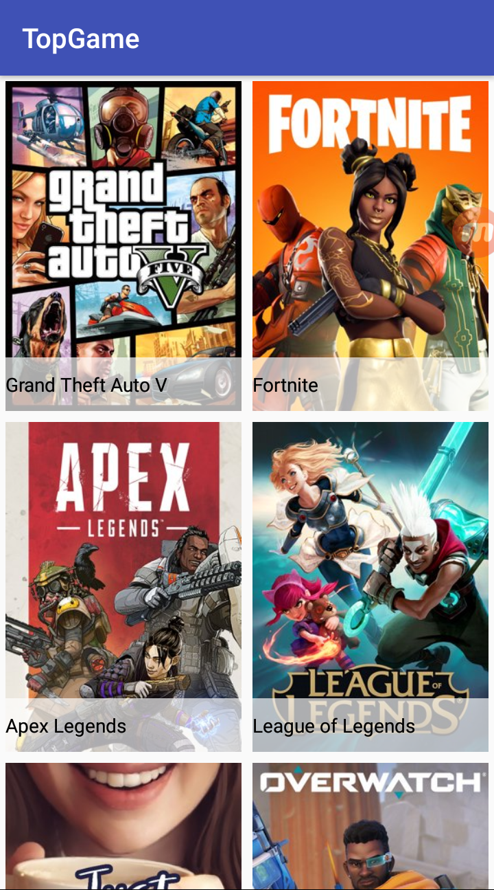
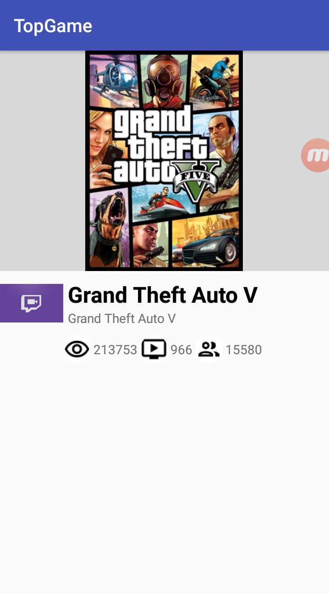

# TopGame
> Projeto criado para testar meus conhecimentos em Kotlin.

[![Build Status][travis-image]][travis-url]
[![License][license-image]][license-url]

Este projeto, foi um teste solicitado por uma empresa, para testar meus conhecimentos em Kotlin.

## Features

- [x] Lista Top Games
- [x] Detalhe

## Requirements
- Android 5.0+
- Android Studio

## Meta

Lucas Neto Santana – [@LinkedIn](https://www.linkedin.com/in/lucasnetosantana/)

Distributed under the XYZ license. See ``LICENSE`` for more information.

[https://github.com/LucasNeto/TopGame](https://github.com/LucasNeto/TopGame)

[swift-image]:https://img.shields.io/badge/swift-3.0-orange.svg
[swift-url]: https://swift.org/
[license-image]: https://img.shields.io/badge/License-MIT-blue.svg
[license-url]: LICENSE
[travis-image]: https://img.shields.io/travis/dbader/node-datadog-metrics/master.svg?style=flat-square
[travis-url]: https://travis-ci.org/dbader/node-datadog-metrics